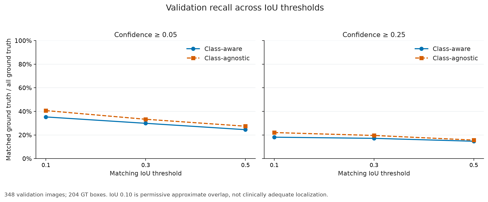
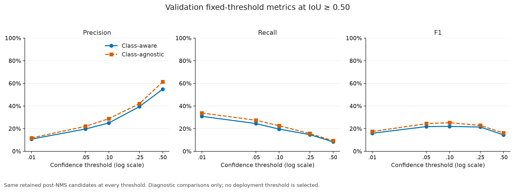
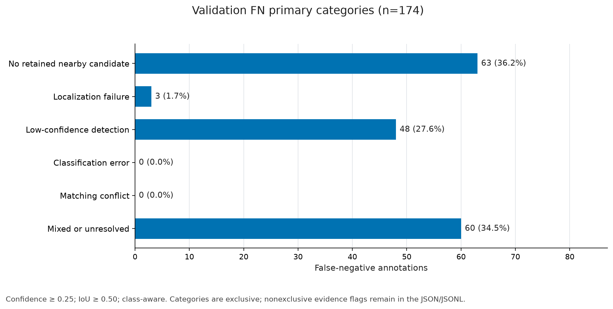
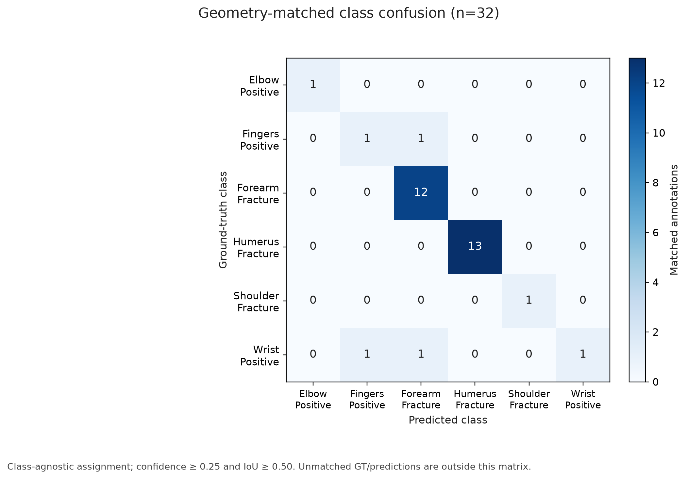
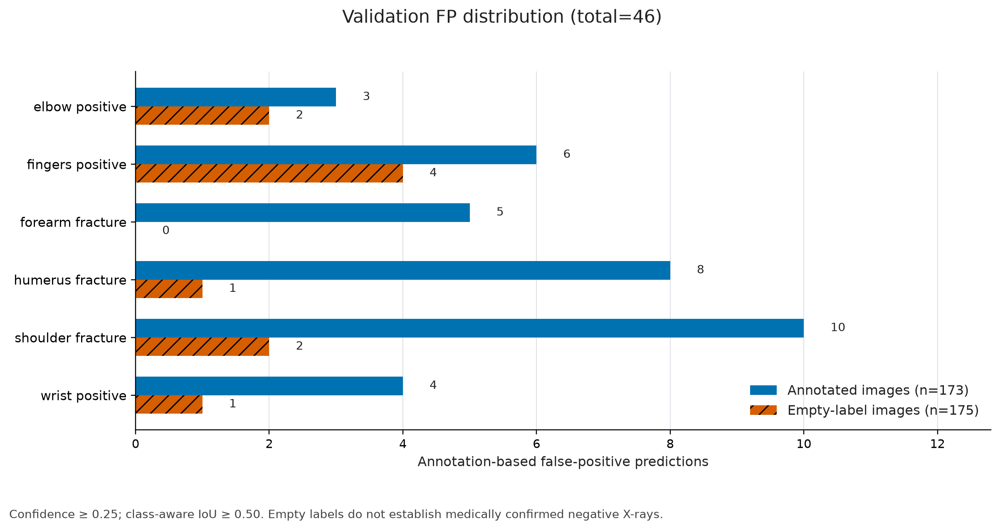
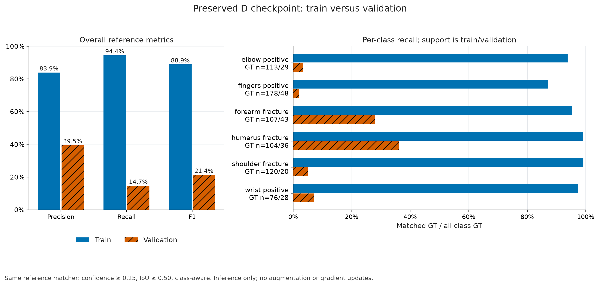

# Experiment D: Phase 4, Stage 2 quantitative error analysis

This is an executed research diagnostic report, not final thesis prose or clinical validation. Stage 3 and Experiment F have not started.

## Evidence and methods

The numerical source is [stage2_quantitative.json](stage2_quantitative.json), with exact definitions in `analysis.method`. [stage2_verification.json](stage2_verification.json) records regression tests, independent count checks, repeatability, figure inspection, and preservation checks. Counts are exact; displayed percentages and descriptive statistics are rounded.

Checkpoint: `outputs/training/official/D_seed42/weights/best.pt` (YOLOv8s, six original classes, seed 42, best epoch 57); SHA-256 `498e265f90bbf07fc5112b7153a7a11ac09ac819f8b7689e9e832ac302ef2e8a`. Canonical source: `data/prepared/v3_detection_clahe`.

Validation export: `outputs/error_analysis/stage1/D_seed42_repeat_verified/validation_predictions.jsonl`; SHA-256 `8fb1b0004ecf00ece249ff46c9bc12dc0de40d876489ecf13488400794178b22`. Training export: `outputs/error_analysis/stage2/D_seed42_train_export/training_predictions.jsonl`; SHA-256 `c381b93442b894fdf27112082796ff578ca07472235f7cc6f11a40633eb01d5b`. Both complete exports remain under ignored `outputs/`.

| Split | Images | Annotated images | Empty-label images | GT boxes | Exported predictions |
| --- | --- | --- | --- | --- | --- |
| train | 1211 | 604 | 607 | 698 | 7012 |
| valid | 348 | 173 | 175 | 204 | 1755 |

Inference: image size 640, rectangular batches of 16, fused model, FP32, AMP disabled, export confidence >0.001, class-aware multi-label NMS at IoU 0.7, max_det=300, no class filter or merged classes, workers=0. Training augmentation and gradient tracking were disabled. The guarded training snapshot aliases only training images to the framework's evaluation loader; its YAML has no test key. The loader recorded 1,211 training, zero validation, and zero test images.

Runtime: Ultralytics 8.4.155, PyTorch 2.6.0+cu126, NVIDIA GeForce RTX 4050 Laptop GPU; deterministic seed 42. Train and validation use the same inference options apart from output paths.

Matching reuses Stage 1's confidence-first greedy one-to-one matcher. Predictions are processed by descending score; score ties use stable prediction IDs, overlap ties use stable GT IDs. Each prediction claims its highest-IoU eligible unmatched GT. Confidence and matching IoU thresholds are inclusive. Class-agnostic matching removes class equality only. TP+FN equals GT support and TP+FP equals retained predictions. Precision=TP/(TP+FP), recall=TP/(TP+FN), F1=2TP/(2TP+FP+FN). Zero denominators follow Stage 1's zero convention; absent descriptive statistics are null. These are fixed-threshold diagnostics, not native Ultralytics AP.

Reference condition: confidence >=0.25, IoU >=0.50, class-aware. Complete-miss and FN candidate analyses include all exported candidates above 0.001; NMS-suppressed or lower-scored responses are unavailable.

### Preserved Stage 1 reproduction discrepancy

| Native metric | Official epoch 57 | Standalone checkpoint | Absolute difference | Original check |
| --- | --- | --- | --- | --- |
| metrics/mAP50(B) | 0.14861 | 0.14852411 | 0.00008589 | FAIL |
| metrics/mAP50-95(B) | 0.04732 | 0.04736909 | 0.00004909 | Pass |

The original absolute tolerance remains 0.00005; overall reproduction remains **failed**. The user explicitly authorized Stage 2 despite this discrepancy. Official A-E results remain unchanged. Preserved-checkpoint outputs supply these reproducible diagnostics; exact training-time metric reproduction is not claimed. FP16 checkpoint serialization versus the original FP32 EMA remains a plausible, unproven explanation.

## A. IoU sensitivity

Source: `analysis.analysis_a_iou_sensitivity`. Matched GT count equals TP in every row.

| Mode | Confidence | IoU | TP / matched GT | FP | FN | Precision | Recall | F1 |
| --- | --- | --- | --- | --- | --- | --- | --- | --- |
| Aware | 0.05 | 0.10 | 72 | 182 | 132 | 28.3% | 35.3% | 31.4% |
| Aware | 0.05 | 0.30 | 61 | 193 | 143 | 24.0% | 29.9% | 26.6% |
| Aware | 0.05 | 0.50 | 50 | 204 | 154 | 19.7% | 24.5% | 21.8% |
| Aware | 0.25 | 0.10 | 37 | 39 | 167 | 48.7% | 18.1% | 26.4% |
| Aware | 0.25 | 0.30 | 35 | 41 | 169 | 46.1% | 17.2% | 25.0% |
| Aware | 0.25 | 0.50 | 30 | 46 | 174 | 39.5% | 14.7% | 21.4% |
| Agnostic | 0.05 | 0.10 | 83 | 171 | 121 | 32.7% | 40.7% | 36.2% |
| Agnostic | 0.05 | 0.30 | 68 | 186 | 136 | 26.8% | 33.3% | 29.7% |
| Agnostic | 0.05 | 0.50 | 56 | 198 | 148 | 22.0% | 27.5% | 24.5% |
| Agnostic | 0.25 | 0.10 | 45 | 31 | 159 | 59.2% | 22.1% | 32.1% |
| Agnostic | 0.25 | 0.30 | 40 | 36 | 164 | 52.6% | 19.6% | 28.6% |
| Agnostic | 0.25 | 0.50 | 32 | 44 | 172 | 42.1% | 15.7% | 22.9% |



Measured: at confidence 0.05, class-aware recall increases from 24.5% (50/204) at IoU 0.50 to 35.3% (72/204) at IoU 0.10. At confidence 0.25, it increases from 14.7% (30/204) to 18.1% (37/204). Interpretation: looser geometry recovers some matches, but most annotations remain unmatched even under permissive overlap. IoU 0.10 is approximate spatial overlap, not clinically adequate localization. These differences do not uniquely isolate localization error or any other mechanism.

## B. Confidence sensitivity and localization association

Source: `analysis.analysis_b_confidence_sensitivity`. IoU is fixed at 0.50; the class-agnostic comparison appears in F2. No deployment threshold is selected.

| Confidence | TP | FP | FN | Precision | Recall | F1 |
| --- | --- | --- | --- | --- | --- | --- |
| 0.01 | 63 | 523 | 141 | 10.8% | 30.9% | 15.9% |
| 0.05 | 50 | 204 | 154 | 19.7% | 24.5% | 21.8% |
| 0.10 | 40 | 120 | 164 | 25.0% | 19.6% | 22.0% |
| 0.25 | 30 | 46 | 174 | 39.5% | 14.7% | 21.4% |
| 0.50 | 17 | 14 | 187 | 54.8% | 8.3% | 14.5% |



Measured: lowering confidence from 0.25 to 0.01 adds 33 TP (30 to 63), while FP rises from 46 to 523. Recall increases from 14.7% to 30.9%, with precision falling from 39.5% to 10.8%. Thus useful lower-confidence candidates coexist with a large FP burden.

Candidate localization uses only the 1314 predictions on annotated images; 441 predictions on empty-label images are excluded because they have no GT localization target. Each candidate is compared with its best GT overlap, independently of one-to-one matching. Multiple candidates can overlap the same annotation.

| Confidence interval | Candidates | Median max IoU (any / correct class) | IoU>=0.50 any class | IoU>=0.50 correct class |
| --- | --- | --- | --- | --- |
| [0.001, 0.01) | 852 | 0.126 / 0.000 | 146 (17.1%) | 82 (9.6%) |
| [0.01, 0.05) | 243 | 0.209 / 0.000 | 51 (21.0%) | 38 (15.6%) |
| [0.05, 0.1) | 81 | 0.269 / 0.000 | 19 (23.5%) | 14 (17.3%) |
| [0.1, 0.25) | 72 | 0.254 / 0.087 | 23 (31.9%) | 15 (20.8%) |
| [0.25, 0.5) | 39 | 0.468 / 0.084 | 19 (48.7%) | 15 (38.5%) |
| [0.5, 1] | 27 | 0.620 / 0.591 | 19 (70.4%) | 17 (63.0%) |

Measured Spearman score/max-IoU association: 0.140 for any GT class and 0.165 for correct-class GT. The highest-confidence bin has better overlap on average, while the overall rank association is weak. This is a descriptive candidate association with clustered observations; it is not calibration, one-to-one precision, statistical significance, or causal evidence.

## C. False-negative taxonomy

Source: `analysis.analysis_c_fn_taxonomy`; per-GT candidate identities and flags: `outputs/error_analysis/stage2/D_seed42_verified/false_negatives.jsonl`. Definitions were saved before real-data categorization; the pre-execution record and hash are in the evidence.

A nearby retained candidate has IoU>=0.10. Strong signals are: same-class/confidence>=0.25/IoU>=0.50 already assigned to another GT (conflict); same-class/confidence<0.25/IoU>=0.50 (low confidence); wrong-class/confidence>=0.25/IoU>=0.50 (classification); same-class/confidence>=0.25/0.10<=IoU<0.50 (localization). Conflict takes precedence. Otherwise two or more strong signals give mixed/unresolved, one gives its corresponding category, no nearby candidate gives complete miss, and remaining cases are mixed/unresolved. A low-confidence wrong-class poorly localized candidate does not establish any one simple mechanism. All eight class/confidence/geometry combinations and nonexclusive flags remain available.

| Exclusive primary category | FN count | % of all reference FN |
| --- | --- | --- |
| Complete miss (retained scope) | 63 | 36.2% |
| Localization failure | 3 | 1.7% |
| Low-confidence detection | 48 | 27.6% |
| Classification error | 0 | 0.0% |
| Matching conflict | 0 | 0.0% |
| Mixed or unresolved | 60 | 34.5% |



Nonexclusive strong evidence: Localization failure: 9; Low-confidence detection: 56; Classification error: 2; Matching conflict: 0. The 2 classification flags coexist with other strong evidence and therefore receive mixed primary labels. Zero primary classification cases does not mean no wrong-class responses. Low-confidence candidate existence does not guarantee recovery under one-to-one competition. Complete miss refers only to retained candidates; model-head responses removed by export filtering cannot be examined.

Class-wise primary categories below use count (% of that class's FN), so row percentages sum to 100%.

| Class | FN | Miss | Localization | Low confidence | Classification | Conflict | Mixed |
| --- | --- | --- | --- | --- | --- | --- | --- |
| elbow positive | 28 | 12 (42.9%) | 0 (0.0%) | 6 (21.4%) | 0 (0.0%) | 0 (0.0%) | 10 (35.7%) |
| fingers positive | 47 | 21 (44.7%) | 0 (0.0%) | 13 (27.7%) | 0 (0.0%) | 0 (0.0%) | 13 (27.7%) |
| forearm fracture | 31 | 8 (25.8%) | 0 (0.0%) | 14 (45.2%) | 0 (0.0%) | 0 (0.0%) | 9 (29.0%) |
| humerus fracture | 23 | 4 (17.4%) | 2 (8.7%) | 6 (26.1%) | 0 (0.0%) | 0 (0.0%) | 11 (47.8%) |
| shoulder fracture | 19 | 6 (31.6%) | 1 (5.3%) | 6 (31.6%) | 0 (0.0%) | 0 (0.0%) | 6 (31.6%) |
| wrist positive | 26 | 12 (46.2%) | 0 (0.0%) | 3 (11.5%) | 0 (0.0%) | 0 (0.0%) | 11 (42.3%) |

## D. Class-wise, size, and confusion analysis

Source: `analysis.analysis_d_classes`. All six original class IDs remain intact; reference class-aware matching.

| ID / class | GT (% of 204) | TP | FP | FN | Precision | Recall | Median matched IoU (n) |
| --- | --- | --- | --- | --- | --- | --- | --- |
| 0 / elbow positive | 29 (14.2%) | 1 | 5 | 28 | 16.7% | 3.4% | 0.680 (1) |
| 1 / fingers positive | 48 (23.5%) | 1 | 10 | 47 | 9.1% | 2.1% | 0.641 (1) |
| 2 / forearm fracture | 43 (21.1%) | 12 | 5 | 31 | 70.6% | 27.9% | 0.712 (12) |
| 3 / humerus fracture | 36 (17.6%) | 13 | 9 | 23 | 59.1% | 36.1% | 0.658 (13) |
| 4 / shoulder fracture | 20 (9.8%) | 1 | 12 | 19 | 7.7% | 5.0% | 0.567 (1) |
| 5 / wrist positive | 28 (13.7%) | 2 | 5 | 26 | 28.6% | 7.1% | 0.571 (2) |

Measured: forearm and humerus account for 25 of 30 TP (83.3%), despite only 79 of 204 GT boxes (38.7%). Their fixed-threshold recalls are 27.9% and 36.1%; other class recalls range from 2.1% to 7.1%. This corroborates the earlier class contrast without establishing its cause. Elbow, shoulder, and wrist have fewer than 30 GT boxes; all class-specific matched-IoU groups have fewer than 30 observations (four classes have only one or two TP). Those localization medians are particularly unstable and selection-conditional.

Size groups use the GT shorter side after nominal scaling by min(640/width, 640/height), not the actual padded tensor shape. Each GT enters exactly one group. Cells below show TP/GT (recall); * marks support<30. These descriptive boundaries were fixed before analysis.

| Class | <32 px | 32 to <64 px | >=64 px |
| --- | --- | --- | --- |
| All classes | 0/18 (0.0%)* | 5/83 (6.0%) | 25/103 (24.3%) |
| elbow positive | 0/2 (0.0%)* | 0/12 (0.0%)* | 1/15 (6.7%)* |
| fingers positive | 0/4 (0.0%)* | 0/29 (0.0%)* | 1/15 (6.7%)* |
| forearm fracture | 0/6 (0.0%)* | 5/21 (23.8%)* | 7/16 (43.8%)* |
| humerus fracture | 0/0 (n/a)* | 0/3 (0.0%)* | 13/33 (39.4%) |
| shoulder fracture | 0/0 (n/a)* | 0/4 (0.0%)* | 1/16 (6.2%)* |
| wrist positive | 0/6 (0.0%)* | 0/14 (0.0%)* | 2/8 (25.0%)* |

Measured validation recall from smaller to larger groups: 0/18 (0.0%); 5/83 (6.0%); 25/103 (24.3%). Class composition and very limited support in most class/size cells confound interpretation. The <30 marker is a caution rule, not a statistical power calculation or evidence of a universal size cutoff.



At the class-agnostic reference point, 3 of 32 geometric matches (9.4%) have the wrong class: 1 fingers positive GT predicted as forearm fracture; 1 wrist positive GT predicted as fingers positive; 1 wrist positive GT predicted as forearm fracture. There are 29 diagonal matches. Unmatched GT and predictions are outside the matrix; it is not a full confusion matrix with a background class. Removing class eligibility can rearrange greedy assignments, so 3 wrong-class matches and 2 additional matched GT are different quantities.

## E. False positives

Source: `analysis.analysis_e_false_positives`; reference class-aware matching. A false positive means no eligible matching annotation, not a clinically false diagnosis.

| Image group | Images | FP (% of all FP) | Images with FP | % of group images | FP / all group images | Median confidence [P25, P75] |
| --- | --- | --- | --- | --- | --- | --- |
| annotated | 173 | 36 (78.3%) | 30 | 17.3% | 0.208 | 0.376 [0.322, 0.550] |
| empty_label | 175 | 10 (21.7%) | 9 | 5.1% | 0.057 | 0.463 [0.405, 0.554] |

| Predicted class | All FP (% of 46) | Annotated-image FP | Empty-label-image FP |
| --- | --- | --- | --- |
| elbow positive | 5 (10.9%) | 3 | 2 |
| fingers positive | 10 (21.7%) | 6 | 4 |
| forearm fracture | 5 (10.9%) | 5 | 0 |
| humerus fracture | 9 (19.6%) | 8 | 1 |
| shoulder fracture | 12 (26.1%) | 10 | 2 |
| wrist positive | 5 (10.9%) | 4 | 1 |



All 46 FP have median confidence 0.393, P10-P90 0.271-0.721, range 0.260-0.838. At prediction-pair IoU>=0.50, 4 FP overlap another retained same-class prediction and 7 overlap another-class prediction. 2 FP overlap a matched same-class TP (duplicate-like). Unique unordered pairs involving an FP: 3 same-class and 5 cross-class. FP counts and pair counts have different denominators and signals can overlap. These measures do not identify anatomical causes.

Empty-label images account for 10/46 FP; 9/175 (5.1%) have a prediction at the reference threshold. Most FP occur on annotated images (36/46). Empty labels are not medically confirmed negatives, and annotation completeness is unresolved. Detailed visual assessment is reserved for Stage 3.

## F. Generalization and class-agnostic matching

### F1. Train versus validation

Source: `analysis.analysis_f_generalization`. Same preserved checkpoint, inference settings, IoU 0.50, and class-aware matcher; training evaluation does not fit or update the model.

| Split | Confidence | TP | FP | FN | Precision | Recall | F1 |
| --- | --- | --- | --- | --- | --- | --- | --- |
| train | 0.05 | 690 | 689 | 8 | 50.0% | 98.9% | 66.4% |
| train | 0.25 | 659 | 126 | 39 | 83.9% | 94.4% | 88.9% |
| valid | 0.05 | 50 | 204 | 154 | 19.7% | 24.5% | 21.8% |
| valid | 0.25 | 30 | 46 | 174 | 39.5% | 14.7% | 21.4% |

| Class | Train TP/GT (recall) | Validation TP/GT (recall) |
| --- | --- | --- |
| elbow positive | 106/113 (93.8%) | 1/29 (3.4%) |
| fingers positive | 155/178 (87.1%) | 1/48 (2.1%) |
| forearm fracture | 102/107 (95.3%) | 12/43 (27.9%) |
| humerus fracture | 103/104 (99.0%) | 13/36 (36.1%) |
| shoulder fracture | 119/120 (99.2%) | 1/20 (5.0%) |
| wrist positive | 74/76 (97.4%) | 2/28 (7.1%) |



| Reference distribution (conditional on matching) | Train median | Validation median |
| --- | --- | --- |
| TP confidence | 0.818 | 0.539 |
| TP IoU | 0.829 | 0.652 |

Measured reference recall gap: 79.7 percentage points. Training recall is high across all classes, including those with very low validation recall. Interpretation: the checkpoint can fit the training annotations, with a substantial failure to generalize under this protocol. This is consistent with overfitting and/or distribution or annotation differences; it does not distinguish those causes. TP confidence and overlap distributions are conditional on meeting the reference thresholds and are not population-wide calibration or localization-error estimates.

### F2. Class-aware versus class-agnostic

Both modes use identical D candidates and IoU 0.50. P/R/F1 below are percentages.

| Confidence | Aware TP/FP/FN | Aware P/R/F1 | Agnostic TP/FP/FN | Agnostic P/R/F1 |
| --- | --- | --- | --- | --- |
| 0.01 | 63/523/141 | 10.8%/30.9%/15.9% | 69/517/135 | 11.8%/33.8%/17.5% |
| 0.05 | 50/204/154 | 19.7%/24.5%/21.8% | 56/198/148 | 22.0%/27.5%/24.5% |
| 0.10 | 40/120/164 | 25.0%/19.6%/22.0% | 46/114/158 | 28.7%/22.5%/25.3% |
| 0.25 | 30/46/174 | 39.5%/14.7%/21.4% | 32/44/172 | 42.1%/15.7%/22.9% |
| 0.50 | 17/14/187 | 54.8%/8.3%/14.5% | 19/12/185 | 61.3%/9.3%/16.2% |

At the reference point, ignoring labels increases TP from 30 to 32 and recall from 14.7% to 15.7%. At confidence 0.01 it increases TP from 63 to 69 and recall from 30.9% to 33.8%. Classification contributes some errors, but removing class equality does not resolve low validation recall. NMS was still class-aware; this is neither independently class-agnostic NMS nor class-agnostic AP. The optional D/E comparison is omitted: E needs a separate export and has a different, merged target definition. Its native AP is not directly interchangeable with these six-class diagnostics.

## Interpretation, limitations, and follow-up

Measured evidence points to several interacting limitations: retained misses, usable low-confidence candidates, incomplete localization, strongly uneven class behavior, annotation-based FP, and a large train/validation gap. The exclusive taxonomy intentionally leaves many cases mixed/unresolved. Neither these counts nor the small class-agnostic gain proves one dominant causal factor.

Limitations: one checkpoint/seed, small class and size groups, unadjudicated annotations and uncertain empty-label semantics, post-NMS/export truncation, conditional matched-box statistics, and unknown patient/study independence. Encoded image hashes and filenames have zero exact train/validation intersections; this does not rule out near-duplicates or shared patients. No held-out test files were opened. The Stage 1 reproduction failure remains unresolved and separate from passing Stage 2 consistency checks.

Preservation checks compare 157 protected files with the pre-execution hash baseline, covering official A-E artifacts, configurations, Stage 1 evidence/exports, dependency files, and the three pre-existing Phase 2F changes. Restricted train/validation source fingerprints and checkpoint hashes remain unchanged. No model training, split changes, dependency changes, qualitative overlays, or thesis Word edits were performed.

Stage 3 should visually inspect a deterministic class/size-stratified selection of retained misses, low-confidence and mixed FN, the few wrong-class geometric matches, duplicate-like FP, and FP in both annotated and empty-label groups. Review annotation alignment/completeness and image-domain differences as questions, without presuming anatomical or medical explanations.

For a later Experiment F, the strong generalization gap supports prioritizing one controlled, justified generalization intervention after Stage 3 (for example a constrained augmentation or regularization change). Class and scale support may motivate a targeted hypothesis, but current evidence does not select the intervention, justify class merging as a solution, or support threshold tuning. Preserve A-E, fixed splits and test isolation; predefine one changed factor and validation criteria before any new experiment. No Experiment F configuration or training is created here.

## Reproduction

Run from the repository root with the existing project environment:

```powershell
.venv/Scripts/python.exe -B -m bone_fracture_pipeline.error_analysis_quantitative
```

A fresh ignored output directory is required. By default the command exports training predictions in inference mode, verifies the Stage 1 export and source identities, runs all groups, and generates this report and six figures. To reuse the verified training export without new inference:

```powershell
.venv/Scripts/python.exe -B -m bone_fracture_pipeline.error_analysis_quantitative `
  --output outputs/error_analysis/stage2/D_seed42_rerun `
  --reuse-training outputs/error_analysis/stage2/D_seed42_train_export
```

Use `--no-publish` for an ignored numerical rerun that leaves the tracked report/figures unchanged. Raw FN/FP/per-image JSONL, CSV tables, logs, snapshot caches, and full exports remain ignored. No command accepts a test-split option.
